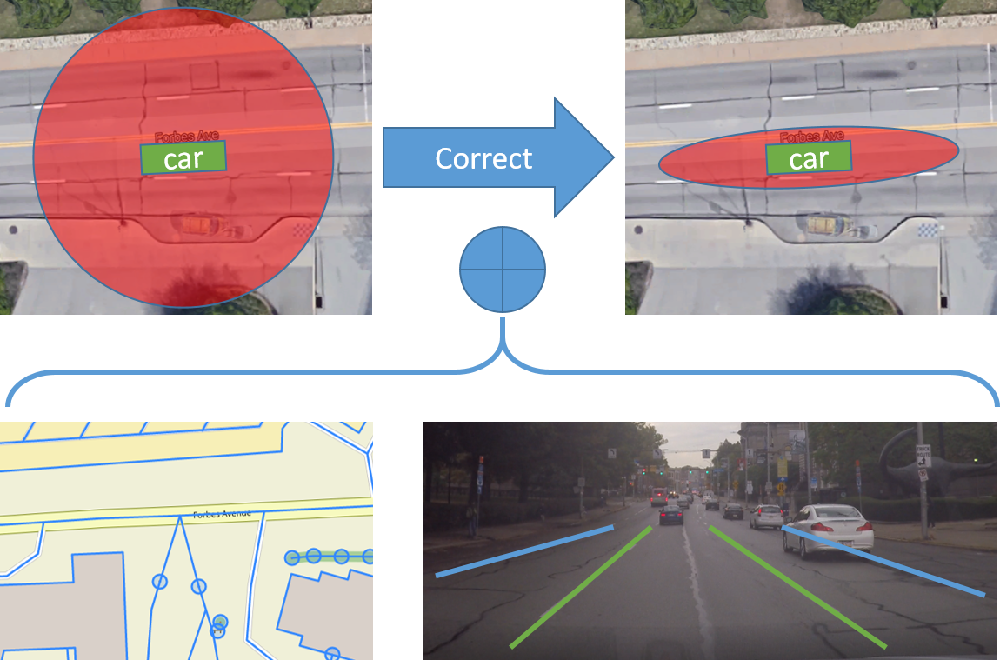
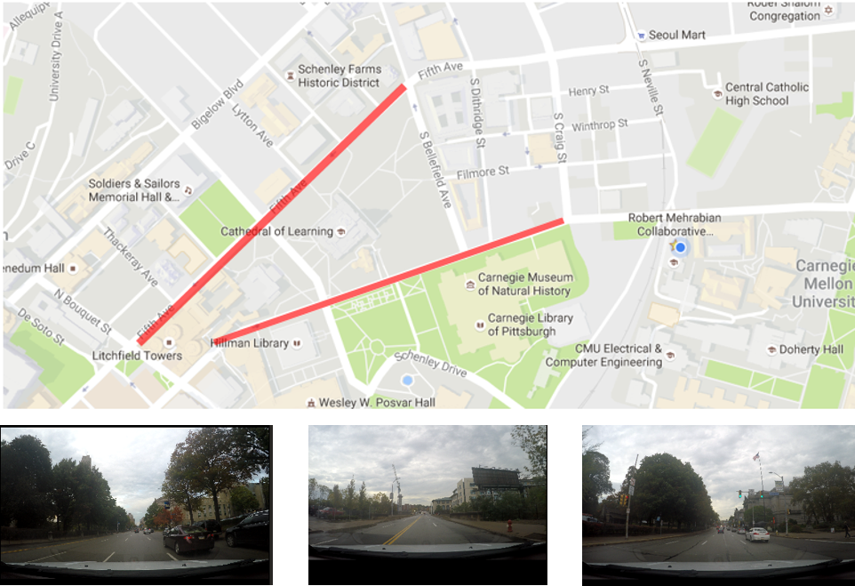
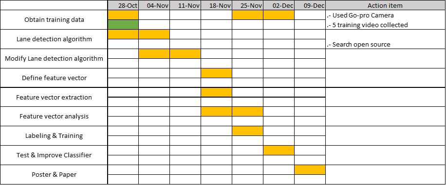

Team Members
============

Mengwen He, Iljoo Baek

Project Title
=============

Vehicle’s Lane-changing Behavior Detection and Tracking

Project Discription
===================

-   **Problem**
    GPS localization accuracy can be affected by the multi-path interference problem caused by trees, buildings or overhead bridges.

-   **Solution**
    Integrate the vision-based relative localization result and a digital map to increase the global localization accuracy.

-   **This Project’s Objective**
    Develop a mono-camera based lane-changing behavior detection and tracking algorithm module for the correction of lateral GPS localization.

    

-   **This Project’s Assumption**

    -   This module will only work on the road with clear lane markers, and the intersection is not in its scope.

    -   We assume that an accurate global digit map exists and contains the lane information.

    -   We assume that the initially occupied lane is known from an upstream algorithm module.

Data collected/to be collected
==============================

We used a Go-pro camera (Hero 4) with high-definition resolution (\(1920 \times 1080\)). The first training data set was captured near the campus (Fifth & Forbes) as shown in the following map.

A brief description of the method proposed to tackle the problem
================================================================

The lane-change behavior detection will be triggered when the car crosses a detected lane marker, and the tracking of this behavior will end when the car returns to the middle of a lane. So the lane-change behaviors may last for varied time ranges, and thus should be detected and tracked from a sequence of images. Therefore, we need to define and extract the feature vectors from a range of history frames.

From the images during a lane-change period, we can derive three results: no changing, left changing, or right changing. Then we can determine which lane on the digital map is occupied (the initial occupation is known). Finally we can use this relative information to correct the GPS localization’s lateral position and reduce its lateral error. A Kalman filter or particle filter will be used for this localization information integration.

Accordingly, there will be two classifiers in this project: one is to detect the start or end of the lane-change behavior, and another one is to track the lane-change behavior. Therefore, to train the classifiers, we only need to label the start and end timestamps of lane-changing behaviors. We can use the SVM framework in this project.

Time line (Tasks completed so far AND tasks to be completed)
============================================================

